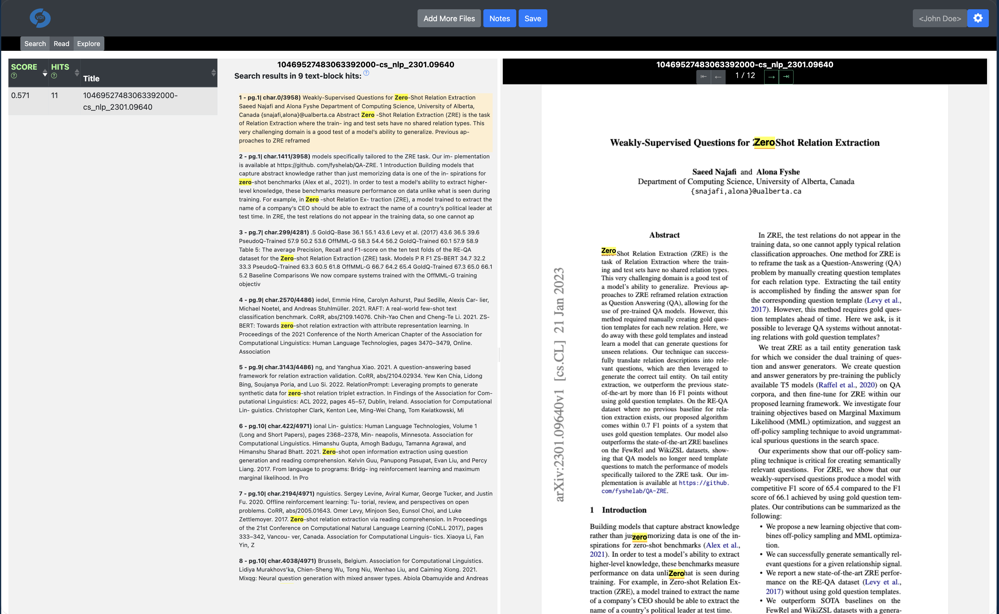

# Visual Document Index (VDI) SPA v3

Integrated AI system for working with text and presenting results to the user.  Includes local, private, in-browser AI tools.

System consists of the following applications:

* client - local interactive search (exact, fuzzy, and AI chat) and review of documents
* backend - web server for integration of pipelines and client
* pipeline - server based models for powerful AI features

Applications use independent dependencies:

* pdfjs-dist
* EnteroDoc
* URL
* vdi-workspace-io

